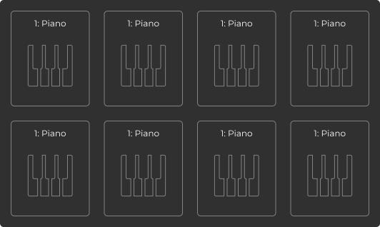

# 楽器選択パネル 仕様・設計

## 1. レイアウト

- 2行×4列のグリッド状に、計8個のカード型パネルを配置する。
- 各カード間には均等な余白を設ける。

## 2. カード内容

- 各カードの上部に「1: Piano」のように、番号と楽器名を表示する。
- カード中央に、楽器を示すアイコン（例：ピアノ鍵盤）を表示する。

## 3. カードデザイン

- カードは角丸・枠線付きのデザインとする。
- 枠線や角丸のスタイルは全体のUIガイドラインに準拠する。

## 4. 操作性

- 各カードはクリックまたはタップで選択可能とする。
- 選択状態の視覚的変化（例：枠線色の変更やシャドウ追加など）を設ける。
- 選択時の挙動や選択解除の仕様は、他の選択UIと一貫性を持たせる。

## 5. 拡張性

- 楽器名やアイコンは将来的に変更・追加できる設計とする。
- カード数の増減にも柔軟に対応できるようにする。
