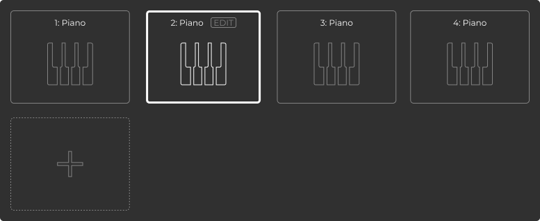
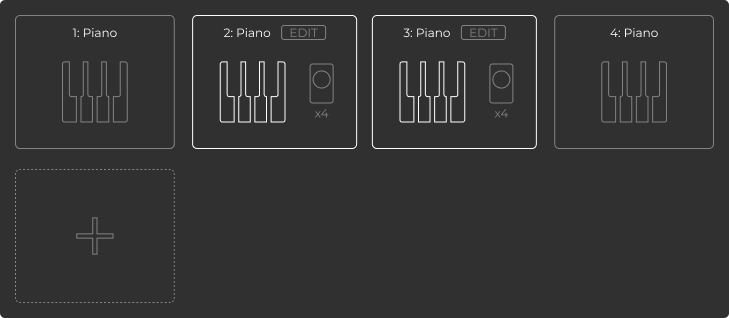

# トラック選択パネル 仕様・設計

## 1. 概要

トラック選択パネルは、Syntheveryシステムで各デバイスが使用するトラックを選択・管理するためのメインパネルです。全デバイスで同じトラックを選択する基本モードと、デバイスごとに異なるトラックを選択する複数選択モードの両方に対応します。

楽器プリセットシステムと連携し、デバイス側のTrackDetailに基づいて楽器名とアイコンを動的に表示します。

## 2. レイアウト

- **基本レイアウト**: 2行×4列のグリッド状に、計8個のトラックカードを配置
- **新規追加ボタン**: 最後のトラックカードの次に新規トラック追加用の「+」ボタンを配置
- **カード間隔**: 均等な余白を設け、視認性を確保

## 3. トラックカード仕様

### 3.1 基本構造
- **トラック番号**: 「1: [楽器名]」形式で表示（1〜8）
- **楽器名**: デバイス側のTrackDetailから動的に取得・表示
- **楽器アイコン**: 楽器プリセットに基づいて動的に表示
- **カードサイズ**: 統一された長方形カード

### 3.2 楽器表示の仕組み
- **デフォルト表示**: デバイス未接続時は「1: Piano」等の固定表示
- **動的表示**: デバイス接続後、TrackDetailのdisplayNameとiconに基づいて更新
- **フォールバック**: 楽器プリセットが見つからない場合はデフォルトアイコンを表示
- **アプリ側保持**: TrackDetailはアプリ側でも保持され、デバイス側と同期

### 3.3 状態表示

#### 非選択状態
- 薄いグレーの細い枠線
- 楽器アイコンはアウトラインのみ
- EDITボタンは非表示

#### 選択状態（単一選択）
- 太い白い枠線で強調表示
- 「EDIT」ボタンを表示（楽器選択画面への遷移用）
- 楽器アイコンはアウトラインのみ

#### 複数選択状態
- 中太の白い枠線で強調表示
- 「EDIT」ボタンを表示
- デバイス数表示（例：「x4」）を右側に表示
- 各トラックに割り当てられているデバイス数を視覚的に表現

## 4. 新規追加ボタン

- **位置**: 下段左側
- **デザイン**: 点線の薄いグレー枠線
- **アイコン**: 大きな「+」記号（薄いグレー）
- **機能**: 新しいトラックを追加（将来的な機能拡張用）

## 5. 状態管理

### 5.1 基本モード（全デバイス同一トラック）
- 全デバイスが同じトラックを選択
- 1つのトラックカードのみが選択状態
- 選択されたトラックのEDITボタンで楽器選択画面に遷移

### 5.2 複数選択モード（デバイスごと異なるトラック）
- デバイスごとに異なるトラックを選択可能
- 複数のトラックカードが選択状態
- 各選択トラックにデバイス数を表示
- 各トラックのEDITボタンで楽器選択画面に遷移

## 6. 操作性

### 6.1 トラック選択
- **クリック/タップ**: トラックカードを選択
- **全選択解除**: 別のトラックを選択すると前の選択が解除

### 6.2 楽器選択画面への遷移
- 選択状態のトラックカードの「EDIT」ボタンをクリック
- 楽器選択画面に遷移し、該当トラックの楽器設定を変更可能
- 楽器プリセットの選択・適用が可能

### 6.3 楽器プリセットの適用
- 楽器選択画面でプリセットを選択
- 選択したプリセットのNoteBuilderConfigとGeneratorConfigをデバイスに送信
- TrackDetailのinstrumentPresetIdを更新
- トラック選択パネルの表示を即座に更新

## 7. 技術実装

### 7.1 楽器プリセット連携
- **プリセット管理**: アプリ側で楽器プリセットライブラリを管理
- **設定同期**: デバイス側のTrackDetailとアプリ側のプリセットを同期
- **動的更新**: 楽器設定変更時にリアルタイムで表示を更新

### 7.2 固定仕様（現時点）
- **トラック数**: 8トラックで固定
- **デフォルト楽器**: 「Piano」で固定（プリセット未設定時）

### 7.3 将来的な拡張予定
- 楽器状態の管理システム
- 楽器名とアイコンの動的表示（実装済み）
- トラック数の可変管理
- 楽器設定の永続化

## 8. デザインガイドライン

### 8.1 カラーパレット
- **背景**: ダークグレー
- **非選択枠線**: 薄いグレー
- **選択枠線**: 白
- **テキスト**: 薄いグレー
- **アイコン**: 薄いグレー

### 8.2 タイポグラフィ
- **トラック番号**: 本文レベル
- **楽器名**: 本文レベル
- **デバイス数**: 小さめのテキスト

### 8.3 レスポンシブ対応
- グリッドレイアウトで画面サイズに応じて調整
- タッチデバイスでの操作性を考慮

## 9. エラーハンドリング

### 9.1 接続状態
- デバイス未接続時はトラック選択を無効化
- 接続状態に応じた視覚的フィードバック

### 9.2 楽器プリセット関連
- 楽器プリセットが見つからない場合のフォールバック処理
- プリセット適用失敗時のエラー表示
- デバイス側との設定同期エラーの処理

### 9.3 選択状態の整合性
- 無効なトラック選択状態の防止
- デバイス数とトラック選択の整合性チェック

## 10. パフォーマンス要件

- **応答時間**: トラック選択操作の応答時間100ms以内
- **楽器表示更新**: プリセット適用後の表示更新200ms以内
- **描画性能**: スムーズな状態変更アニメーション
- **メモリ使用量**: 効率的な状態管理とレンダリング
